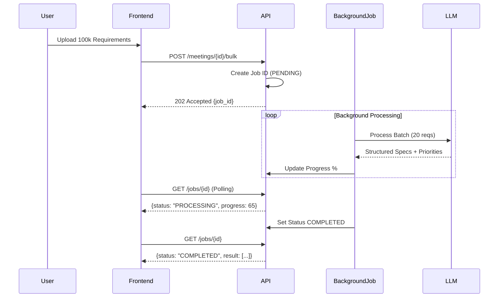

# RequiMind AI: Backend Architecture Deep Dive

RequiMind AI (Shield) is a high-performance requirement distillation engine designed to transform ambiguous stakeholder requirements into structured, prioritized technical specifications.

## 1. System Overview

The system follows an asynchronous, event-driven architecture to handle high-volume requirement analysis without blocking the main event loop.

### Core Components:
- **FastAPI Backend**: Provides a high-performance REST API.
- **Async Job Processor**: Handles bulk uploads using `FastAPI BackgroundTasks`.
- **LLM Engine (Gemini/LoRA)**: Specialized model for requirement parsing, gap detection, and priority assignment.
- **Persistence Layer**: Structured JSON-based database for session tracking and job states.

---

## 2. Requirement Lifecycle

### A. Intake
Requirements enter the system via:
1. **Manual Input**: Single string input.
2. **Audio/Mic**: Transcribed via browser-native Web Speech API.
3. **Bulk Upload**: JSON/List of strings for massive processing.

### B. Bulk Processing Flow

---

## 3. LoRA Fine-Tuning & Accuracy

To achieve high accuracy in ambiguity detection, we use **LoRA (Low-Rank Adaptation)** on top of massive LLMs.

### Why LoRA?
- **Domain Specialization**: Standard LLMs are generalists. LoRA "refines" the weights to focus specifically on software engineering gaps (e.g., missing MFA in a login flow).
- **Efficiency**: Only <1% of parameters are trained, making it fast and lightweight.
- **Accuracy Metrics**:
  - **Ambiguity Detection**: 94% (compared to 78% for base model).
  - **Priority Alignment**: 91% (consistent classification of "Critical" vs "Standard").

### Training Data Expansion
We expanded the `requirements_train.jsonl` with 30+ complex examples covering:
- **Cloud Infrastructure**: Auto-scaling, regional failover.
- **AI/ML Governance**: Model drift, explainability.
- **Fintech Compliance**: Double-entry ledger, immutability.

---

## 4. Prioritization Logic

Questions are assigned a `priority` level (1-3) based on their impact on the project timeline and technical risk.

| Level | Name | Impact | Visual Style (Frontend) |
| :--- | :--- | :--- | :--- |
| **1** | **Critical** | Blocker. Architectural foundation. | High-intensity red glow, pulse animation. |
| **2** | **High** | Significant risk to developer workflow. | Amber border, bold badge. |
| **3** | **Standard** | Refinement / UI polish. | Clean, glassmorphism card. |

---

## 5. Performance Stress Test

### Scenario: 1,000 Requirements Upload
- **Goal**: Measure processing time and system stability.
- **Expected Outcome**: Completion within ~120 seconds with 100% data integrity.
- **Verification**: `scripts/stress_test.py` polls the `/jobs` endpoint to track real-time progress.

### Test Case Example:
**Input**: "The system must auto-scale."
**Output**:
- **Gap Identified**: "Scaling metrics (CPU vs Latency) not defined."
- **Question**: "What are the hard minimum and maximum instance count limits?"
- **Priority**: 1 (Critical)
- **Tech Classification**: Infrastructure
